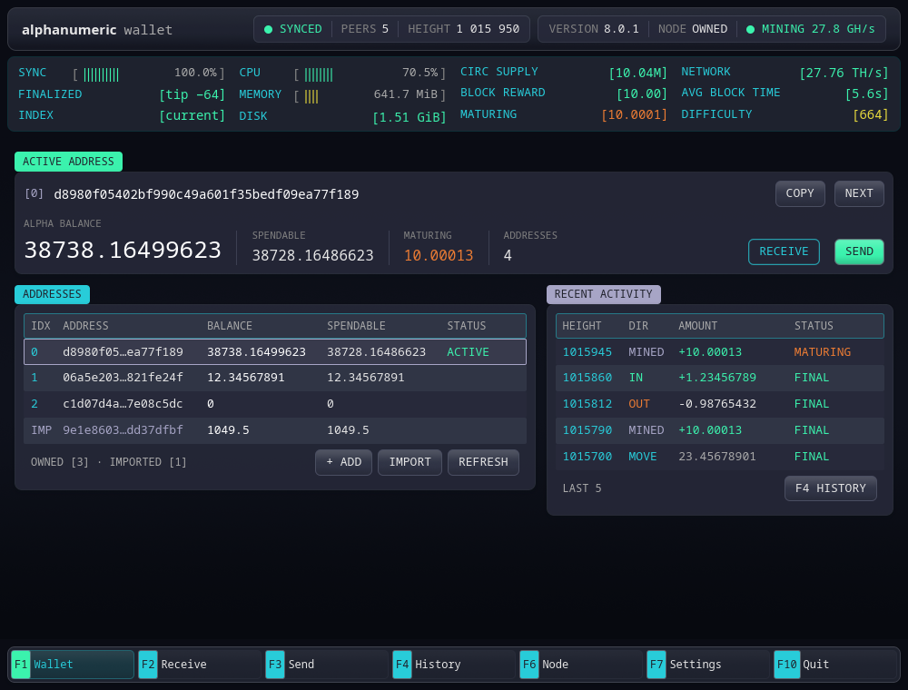
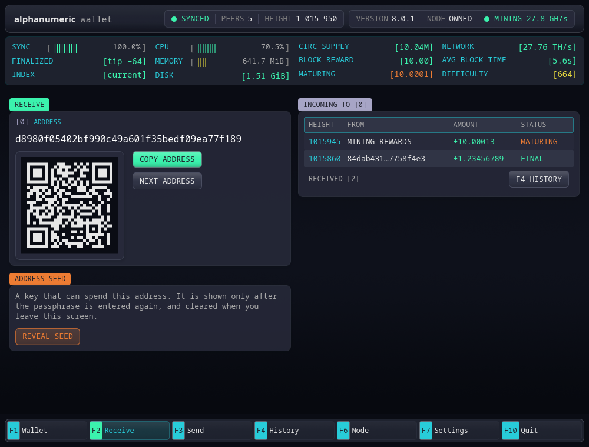
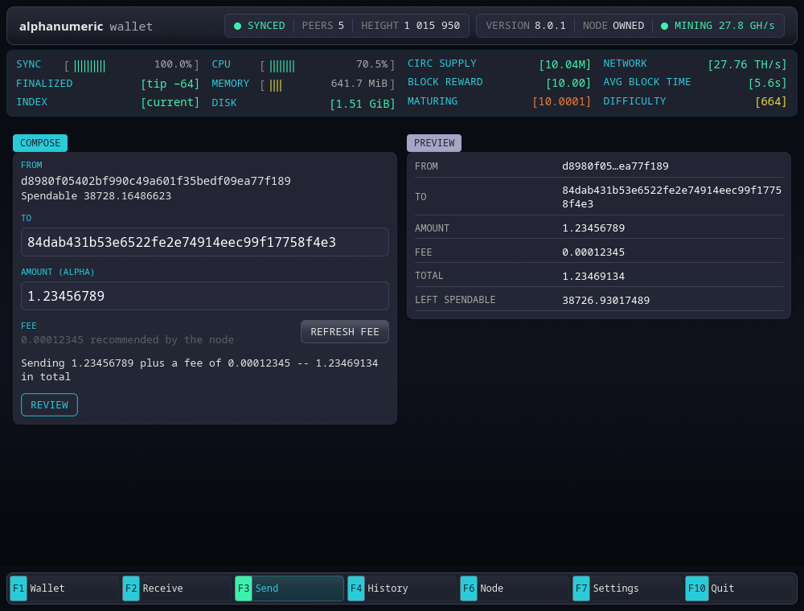
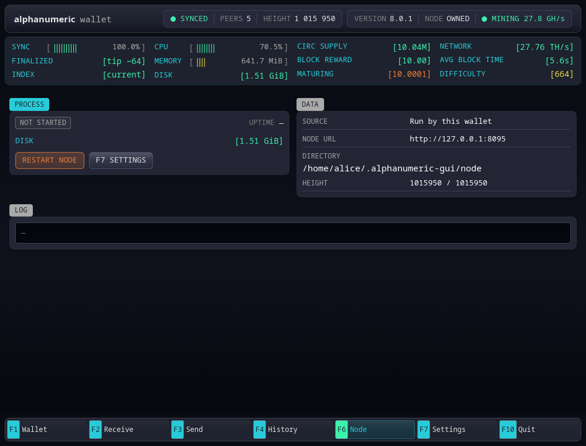
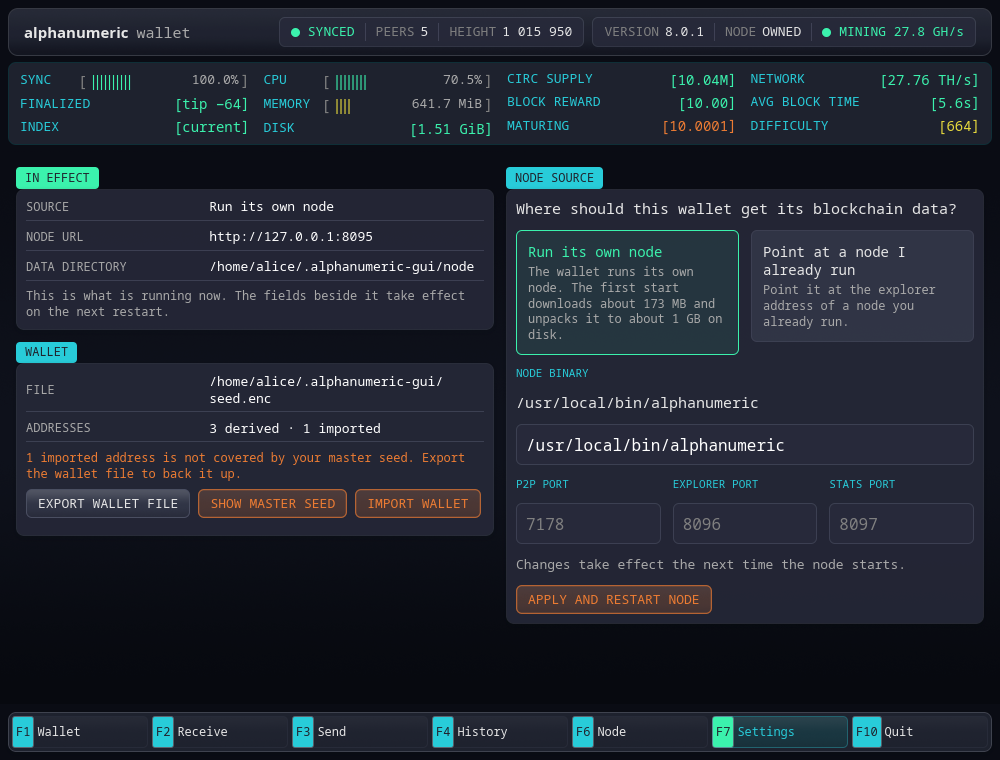
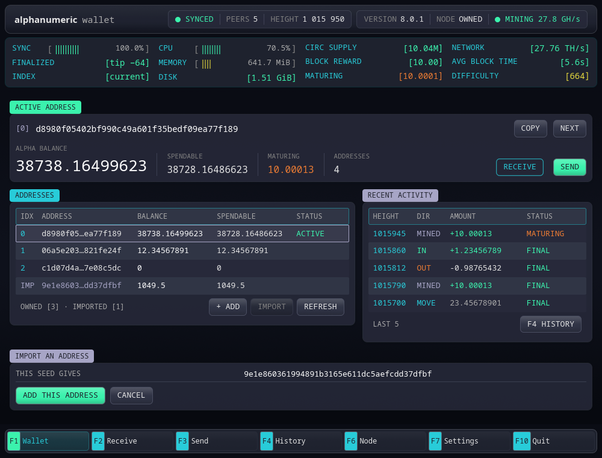

# alphanumeric wallet

A desktop wallet for [alphanumeric](https://www.alphanumeric.blue/), the proof-of-work
layer 1 whose transactions are signed with **ML-DSA-87 (FIPS 204)** rather than an
elliptic curve.

[](#build-from-source)
[](#supported-platforms)
[](#license-and-credits)
[](docs/NODE.md)



The wallet holds its own keys and signs its own transactions. The node it talks to —
whether the one this wallet starts for you or one you already run — never sees a key.
This repository is a fork of the alphanumeric node at **v8.0.1** with the wallet, and the
node-side additions the wallet needs, on top.

---

## What it gives you

- **A wallet that signs locally.** One master seed, many addresses, sealed on disk with
  your passphrase (Argon2id + AES-256-GCM). Keys never leave the machine.
- **Its own node, or yours.** On first run it can download a signed snapshot (~173 MB,
  about 1 GB unpacked) and run a node in `~/.alphanumeric-gui/node`, or point at the
  explorer address of a node you already run.
- **A console the whole time.** Sync, peers, height, CPU, memory, disk, supply, block
  reward, network hashrate and difficulty sit above every screen; F-keys switch screens.
- **Backup you can actually carry.** Export the encrypted wallet file, or re-show the
  76-character master seed behind the passphrase.
- **Keys from a node.** Paste the 64-hex address seed a node's `export-seed` prints, and
  that address joins the wallet — marked apart, spendable, removable.

## Screens

| | |
|---|---|
| **F2 Receive** — the address, its QR, and the per-address seed behind the passphrase |  |
| **F3 Send** — the payment is priced, checked against the spendable ceiling, and shown in full before anything is signed |  |
| **F6 Node** — what the node process is doing, its data directory and its log tail |  |
| **F7 Settings** — which node is in effect, the wallet file, and export / master seed / import |  |
| **Import an address** — paste a node's address seed; the address is shown before anything is stored |  |

## Install

### From a release

Download `alphanumeric-wallet-linux-x86_64` (and, to run your own node,
`alphanumeric-node-linux-x86_64`) from [Releases](../../releases), then:

```bash
chmod +x alphanumeric-wallet-linux-x86_64
./alphanumeric-wallet-linux-x86_64
```

Verify what you downloaded against the checksums published with the release:

```bash
sha256sum -c SHA256SUMS
```

If you want the wallet to start its own node, the wallet looks for a file named exactly
`alphanumeric` next to itself — so rename the node asset, or name its path in F7 Settings:

```bash
mv alphanumeric-node-linux-x86_64 alphanumeric && chmod +x alphanumeric
```

The binaries link nothing but the C library (X11, Wayland and xkbcommon are opened at
run time), and were built against **glibc 2.39** — Ubuntu 24.04 or newer, or an equally
recent distribution. On anything older, build from source.

### Build from source

Rust 1.93.1 is what this tree is gated on.

```bash
git clone https://github.com/gosrak/alphanumeric-wallet
cd alphanumeric-wallet
cargo build --release -p alphanumeric-gui   # the wallet  -> target/release/alphanumeric-wallet
cargo build --release                       # the node    -> target/release/alphanumeric
```

Linux needs the usual desktop libraries for a `wgpu` window (Mesa, Wayland or X11,
`fontconfig`). The interface fonts are bundled, so text renders the same everywhere.

## First run

1. **Choose where blockchain data comes from** — the wallet's own node, or the explorer
   address of a node you run.
2. **Create or restore a wallet.** A new wallet shows its master seed once and asks you to
   type part of it back before it will go on; a restore takes that seed, the photo the
   wallet was made from, or a wallet file exported from another machine.
3. **Choose a passphrase.** It encrypts the wallet file. Nothing else can open it.

The wallet file lives at `~/.alphanumeric-gui/seed.enc`.

## Backup, in one paragraph

Your master seed restores every address the wallet derived, in order — write it down and
keep it offline. An address **imported** from a node is not derived from that seed, so a
wallet holding one is only fully backed up by the file itself: `F7 → EXPORT WALLET FILE`
writes a copy that is still sealed under your passphrase. The wallet says so on screen
whenever an imported address is present.

## Moving a key between this wallet and a node

Both sides use the same key material: a 32-byte seed, ML-DSA-87, and an address that is
`SHA256(public_key)[..20]`. Both test suites pin the same vector, so an address means the
same thing in both.

| Direction | How |
|---|---|
| Wallet → node | `F2 → ADDRESS SEED` (passphrase), then paste at the node's `import-seed` prompt |
| Node → wallet | node `export-seed`, then paste into `F1 → IMPORT` |

Never paste a **master** seed at a node prompt: it is the root of a derivation tree, not
an address key. The node refuses it, and so does the wallet's import field.

## What this fork adds to the node

The wallet needs things the upstream node did not expose, so they live here too:

- `/explorer/status` reports what the node is mining, and `/explorer/address` returns the
  `position` a history cursor needs.
- A `/stats` server for the console's figures.
- Headless mining (`ALPHANUMERIC_HEADLESS=1`, `ALPHANUMERIC_MINE=<wallet>`), so the wallet
  can supervise a node with no REPL.
- `export-seed` / `import-seed`, the bridge that moves one address key between the two.

Everything else about the node — consensus, storage, networking, CLI, environment
variables — is upstream's, and its reference is kept in **[docs/NODE.md](docs/NODE.md)**.

## Security notes

- The wallet file is sealed with Argon2id + AES-256-GCM and written atomically; a replaced
  wallet is moved aside, never overwritten.
- A seed reaches the screen only after the passphrase is entered again, and leaves it when
  you do.
- Sending shows the recipient, amount, fee and total before signing, re-checks the
  spendable ceiling at the moment of signing, and refuses if the key does not belong to
  the address the payment says it is from.
- A payment whose outcome is unknown is retried as the *same* signed body, never re-signed,
  so a retry cannot pay twice.
- Nothing here has been audited by a third party. It is a wallet for people who read code.

## Supported platforms

Built and tested on Linux (x86_64). The node itself supports macOS and Windows as well
(see [docs/NODE.md](docs/NODE.md)); the wallet's process supervision and its data
directory layout are Linux-first and have not been exercised elsewhere.

## License and credits

MIT, the upstream license, kept unchanged — see [LICENSE](LICENSE).

The node is the work of the [alphanumeric project](https://github.com/OSXBasedAnon/alphanumeric);
this repository forks it at **v8.0.1** and adds the wallet. If you are looking for the node
on its own, take it from upstream.
